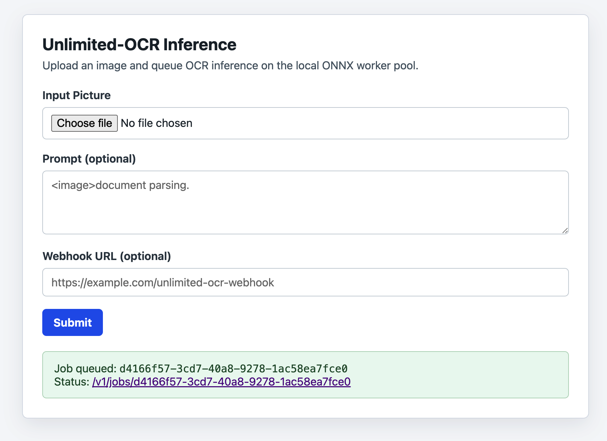

# Unlimited-OCR Inference Server

Minimal Axum server for running Unlimited-OCR ONNX image OCR inference in a background worker queue.

## Documentation

- [Model files](docs/model-files.md)
- [Running the server](docs/running.md)
- [HTTP API](docs/http-api.md)
- [Python client](docs/python-client.md)
- [Configuration](docs/configuration.md)
- [Metadata and cleanup](docs/metadata-and-cleanup.md)

## Author

Yehor Smoliakov <egorsmkv@gmail.com>

## License

Apache License 2.0. See [LICENSE](LICENSE).
